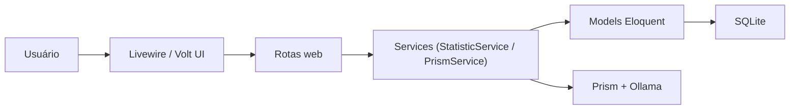

# 🚗 Car App

<p align="center">
  
  
  
  
  
  
</p>

<p align="center">
  
</p>

Aplicação web para gestão de veículos, manutenções, abastecimentos, quilometragem e análise de custos com dashboard interativo e assistente de IA.

---

## ✨ Principais funcionalidades

- Cadastro e gestão de veículos.
- Controle de manutenções por veículo.
- Registro de abastecimentos com histórico de custos.
- Histórico de quilometragem.
- Dashboard com gráficos (30 dias e acumulado 12 meses).
- Chatbot com ferramentas de domínio (Prism + Ollama).
- Proteções de ownership para impedir acesso cruzado entre usuários.

---

## 🧱 Stack técnica

- **Backend:** Laravel 12, PHP 8.2, Eloquent ORM.
- **Frontend:** Livewire 4, Volt, Flux UI, Tailwind CSS 4, Chart.js.
- **Banco (dev/test):** SQLite.
- **Qualidade:** Laravel Pint (PSR-12), PHPUnit 11.
- **DevOps:** Docker/Docker Compose + GitHub Actions (test/lint/build).

---

## 🗂️ Estrutura do projeto

```text
car-app/
├── app/
│   ├── Models/                # Entidades Eloquent
│   ├── Services/              # Regras de negócio (Prism/Statistics)
│   ├── Livewire/              # Componentes Livewire de classe
│   └── Console/Commands/      # Comandos Artisan
├── database/
│   ├── migrations/            # Esquema do banco
│   ├── factories/             # Dados de teste
│   └── seeders/               # Seeders
├── resources/views/
│   ├── pages/                 # Páginas Volt/Blade
│   └── components/            # Componentes visuais
├── routes/
│   └── web.php                # Rotas web e endpoints de gráficos
├── tests/
│   └── Feature/               # Testes de integração/feature
└── .github/workflows/
    └── ci.yml                 # Pipeline CI
```

---

## 🧭 Arquitetura (alto nível)



---

## ✅ Pré-requisitos

- PHP **8.2+**
- Composer
- Node.js **20+** e npm
- SQLite

Opcional:
- Docker + Docker Compose

---

## ⚡ Setup rápido (local)

### 1) Instalar dependências e preparar projeto

```bash
composer run setup
```

Esse script executa:
- `composer install`
- cópia de `.env`
- `php artisan key:generate`
- `php artisan migrate --force`
- `npm install`
- `npm run build`

### 2) Rodar ambiente de desenvolvimento

```bash
composer run dev
```

Serviços iniciados pelo script `dev`:
- servidor Laravel
- worker de fila
- logs (pail)
- Vite em modo dev

---

## 🐳 Setup com Docker

### Subir aplicação

```bash
docker compose up --build
```

A aplicação fica disponível em: `http://localhost:8000`

---

## 🔐 Variáveis de ambiente essenciais

Use `.env.example` como base e revise:

- `APP_ENV`
- `APP_DEBUG`
- `APP_URL`
- `DB_CONNECTION` e `DB_DATABASE`
- credenciais da IA (quando aplicável)

Boas práticas:
- nunca versionar segredos reais
- usar secrets do provedor de deploy/CI

---

## 🧪 Testes

Rodar toda a suíte:

```bash
php artisan test
```

Rodar um arquivo específico:

```bash
php artisan test tests/Feature/CarTest.php
```

Rodar um método específico:

```bash
php artisan test --filter=test_can_create_car
```

Cobertura:

```bash
php artisan test --coverage
```

---

## 🧹 Qualidade de código

### Linux/macOS

```bash
./vendor/bin/pint
./vendor/bin/pint --test
```

### Windows (PowerShell/CMD)

```powershell
php vendor\bin\pint
php vendor\bin\pint --test
```

---

## 🔁 CI/CD (GitHub Actions)

Pipeline em `.github/workflows/ci.yml` com jobs:

- `test`: instala dependências, migra banco e roda testes.
- `lint`: valida estilo com Pint.
- `build`: instala dependências e gera assets.
- `merge-to-main`: merge automático após PR para `development` ser aprovado e fechado como `merged`.

---

## 📊 Módulos de domínio

### Veículos

- Entidade principal: `Car`.
- Relacionamentos com manutenção, abastecimento e quilometragem.

### Manutenções

- Registro de custos de manutenção por veículo.
- Usado em gráficos de custo diário e acumulado.

### Abastecimentos

- Registro de litros, custo e posto.
- Integra com quilometragem para contexto histórico.

### Estatísticas

`StatisticService` expõe dados para gráficos:
- manutenção (últimos 30 dias)
- abastecimento (últimos 30 dias)
- custo acumulado (últimos 12 meses)

### Assistente IA

`PrismService`:
- monta contexto do usuário autenticado
- usa ferramentas para consultar/criar dados de manutenção e abastecimento
- registra histórico de mensagens

---

## 🛡️ Segurança

- Verificação de ownership (`user_id`) antes de ler/alterar recursos.
- Tratamento de exceções em serviços críticos.
- Checklist em `SECURITY_CHECKLIST.md`.

---

## 🧰 Comandos úteis

```bash
php artisan migrate
php artisan migrate:fresh --seed
php artisan optimize:clear
php artisan route:list
```

---

## 🧯 Troubleshooting

### `php` não reconhecido no Windows

Use terminal do Laragon ou adicione PHP ao `PATH`.

### Erro de diretório de testes inexistente no CI

Confirme `phpunit.xml` apontando para `tests/Feature`.

### Falha no Pint por sintaxe de shell no Windows

Evite `./vendor/bin/pint`; use `php vendor\bin\pint`.

---

## 🤝 Contribuição

1. Crie uma branch a partir de `development`.
2. Faça commits com mensagens claras (conventional commits).
3. Rode testes e Pint antes do push.
4. Abra PR descrevendo contexto, mudanças e validação.

---

## 🗺️ Roadmap técnico sugerido

- Extrair componentes Volt inline para classes Livewire dedicadas.
- Ampliar testes de integração para fluxos críticos de autorização.
- Adicionar documentação de API interna para endpoints de gráficos.

---

## 📄 Licença

MIT

---

## 📬 Contato

Dúvidas, sugestões ou colaboração: [aquilahenrique.silva@gmail.com](mailto:aquilahenrique.silva@gmail.com)
